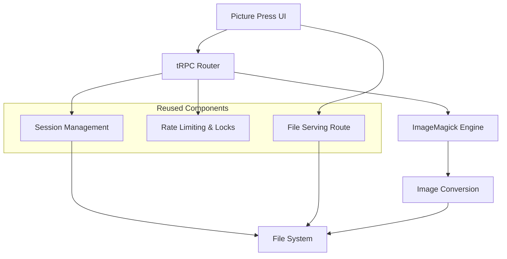

# Design Document

## Overview

Picture Press is a bulk image format conversion feature that integrates seamlessly into the SEO Foundry platform. The design leverages the existing Pixel Forge infrastructure for session management, security, and file serving while introducing specialized conversion capabilities powered by ImageMagick. The feature follows the established patterns of server-side processing with real-time progress updates and secure file delivery.

## Architecture

### High-Level Architecture

Picture Press follows the same architectural patterns as Pixel Forge:



### Component Reuse Strategy

Picture Press maximizes code reuse from Pixel Forge:

- **Session Management**: Reuse existing session utilities with minor adaptations
- **Security Layer**: Identical rate limiting and concurrency control
- **File Serving**: Same secure file serving route with path confinement
- **UI Components**: Adapt UploadArea, ResultGrid, and SidebarOptions for conversion workflow
- **Progress Tracking**: Reuse progress update mechanisms

## Components and Interfaces

### 1. tRPC Router (`src/server/api/routers/picture-press.ts`)

The Picture Press router provides these procedures:

```typescript
export const picturePressRouter = createTRPCRouter({
  // Session management (reused from Pixel Forge)
  newSession: publicProcedure.mutation(),
  
  // Multi-file upload with validation
  uploadImages: publicProcedure
    .input(z.object({
      files: z.array(z.object({
        fileName: z.string(),
        fileData: z.string(), // base64
        mimeType: z.string()
      })),
      sessionId: z.string().uuid().optional()
    }))
    .mutation(),
  
  // Bulk conversion with format and naming options
  convertImages: publicProcedure
    .input(z.object({
      sessionId: z.string().uuid(),
      options: z.object({
        outputFormat: z.enum(["jpeg", "png", "webp", "gif", "tiff", "bmp"]),
        quality: z.number().min(1).max(100).optional(),
        namingConvention: z.enum(["keep-original", "custom-pattern"]),
        customPattern: z.string().optional(), // e.g., "converted_{name}_{index}"
        prefix: z.string().optional(),
        suffix: z.string().optional()
      })
    }))
    .mutation(),
  
  // Progress tracking (reused)
  getConversionProgress: publicProcedure
    .input(z.object({ sessionId: z.string().uuid() }))
    .query(),
  
  // ZIP download (adapted from Pixel Forge)
  zipConvertedImages: publicProcedure
    .input(z.object({ sessionId: z.string().uuid() }))
    .mutation(),
  
  // Cleanup (reused)
  cleanupSession: publicProcedure
    .input(z.object({ sessionId: z.string().uuid() }))
    .mutation()
});
```

### 2. Session Management Adaptation

Extend existing session utilities for multi-file handling:

```typescript
// Extend existing session types
export type ConversionSessionMeta = GenerationSessionMeta & {
  uploadedFiles?: Array<{
    originalName: string;
    tempPath: string;
    mimeType: string;
    size: number;
  }>;
  conversionOptions?: {
    outputFormat: string;
    quality?: number;
    namingConvention: string;
    customPattern?: string;
  };
};

// New utility functions
export async function saveMultipleUploads(params: {
  sessionId: string;
  files: Array<{
    fileName: string;
    base64Data: string;
    mimeType: string;
  }>;
  maxBytes?: number;
}): Promise<Array<{
  savedPath: string;
  size: number;
  originalName: string;
}>>;
```

### 3. Image Conversion Engine

Create a new conversion utility that leverages ImageMagick:

```typescript
// src/server/lib/picture-press/converter.ts
export interface ConversionOptions {
  outputFormat: "jpeg" | "png" | "webp" | "gif" | "tiff" | "bmp";
  quality?: number;
  namingConvention: "keep-original" | "custom-pattern";
  customPattern?: string;
  prefix?: string;
  suffix?: string;
}

export interface ConversionResult {
  originalFile: string;
  convertedFile: string;
  originalName: string;
  convertedName: string;
  originalSize: number;
  convertedSize: number;
  width?: number;
  height?: number;
}

export async function convertImages(
  inputFiles: string[],
  outputDir: string,
  options: ConversionOptions,
  progressCallback?: (current: number, total: number, operation: string) => void
): Promise<ConversionResult[]>;
```

### 4. UI Components

#### Picture Press Page (`src/app/picture-press/page.tsx`)

Main page component that orchestrates the conversion workflow:

```typescript
export default function PicturePressPage() {
  const [sessionId, setSessionId] = useState<string | null>(null);
  const [uploadedFiles, setUploadedFiles] = useState<UploadedFile[]>([]);
  const [conversionOptions, setConversionOptions] = useState<ConversionOptions>({
    outputFormat: "png",
    quality: 90,
    namingConvention: "keep-original"
  });
  const [convertedImages, setConvertedImages] = useState<ConvertedImage[]>([]);
  const [isConverting, setIsConverting] = useState(false);

  // tRPC hooks for API calls
  // UI state management
  // Progress polling logic
}
```

#### Adapted Sidebar (`src/app/_components/PicturePressOptions.tsx`)

Specialized sidebar for conversion options:

```typescript
export type PicturePressSelections = {
  outputFormat: "jpeg" | "png" | "webp" | "gif" | "tiff" | "bmp";
  quality?: number;
  namingConvention: "keep-original" | "custom-pattern";
  customPattern?: string;
  prefix?: string;
  suffix?: string;
};

export default function PicturePressOptions({
  value,
  onChange
}: {
  value: PicturePressSelections;
  onChange: (next: PicturePressSelections) => void;
}) {
  // Format selection UI
  // Quality slider
  // Naming convention options
  // Custom pattern input
}
```

#### Adapted Upload Area

Modify existing UploadArea to handle multiple files:

```typescript
// Enhanced to show multiple file previews
// Batch upload progress
// Individual file validation feedback
```

#### Adapted Result Grid

Modify ResultGrid for conversion results:

```typescript
export type ConvertedImageItem = {
  id: string;
  originalName: string;
  convertedName: string;
  originalUrl: string;
  convertedUrl: string;
  originalSize: number;
  convertedSize: number;
  format: string;
  width?: number;
  height?: number;
};

// Show before/after comparison
// Conversion savings/size changes
// Individual and bulk download options
```

### 5. File Serving Route

Create a new file serving route similar to the existing Pixel Forge file serving route (`src/app/api/pixel-forge/files/[sessionId]/[...filePath]/route.ts`) if needed. The existing route should work as-is since it provides session-scoped file access.

## Data Models

### Session Data Structure

```
/tmp/picture-press-sessions/{sessionId}/
├── uploads/
│   ├── original-image1.jpg
│   ├── original-image2.png
│   └── original-image3.gif
├── converted/
│   ├── image1.webp
│   ├── image2.webp
│   └── image3.webp
├── converted-images.zip
├── progress.json
└── session.json
```

### Progress Tracking

```typescript
type ConversionProgress = {
  current: number;
  total: number;
  currentOperation: string;
  filesProcessed: number;
  totalFiles: number;
  currentFile?: string;
};
```

### API Response Types

```typescript
type ConversionResponse = {
  sessionId: string;
  convertedImages: Array<{
    originalName: string;
    convertedName: string;
    originalSize: number;
    convertedSize: number;
    downloadUrl: string;
    previewUrl: string;
    width?: number;
    height?: number;
    compressionRatio: number;
  }>;
  totalOriginalSize: number;
  totalConvertedSize: number;
  totalSavings: number;
};
```

## Error Handling

### Validation Errors
- Invalid file formats
- File size limits exceeded
- Unsupported conversion combinations
- Invalid naming patterns

### Processing Errors
- ImageMagick conversion failures
- Disk space issues
- Session timeouts
- Concurrent operation conflicts

### Error Response Strategy
- Graceful degradation for partial failures
- Clear error messages with actionable guidance
- Automatic retry for transient failures
- Fallback to alternative processing methods when possible

## Testing Strategy

### Unit Tests
- Conversion utility functions
- Naming convention logic
- File validation
- Progress calculation

### Integration Tests
- tRPC router procedures
- Multi-file upload workflow
- Conversion pipeline end-to-end
- Security and rate limiting

### Component Tests
- UI component behavior
- File upload interactions
- Progress display accuracy
- Download functionality

### Test Data
- Sample images in various formats
- Edge cases (very large files, unusual formats)
- Batch processing scenarios
- Error condition simulations

## Security Considerations

### Input Validation
- File type verification beyond MIME type checking
- File size limits per file and per batch
- Filename sanitization
- Base64 payload validation

### Rate Limiting
- Reuse existing Pixel Forge rate limiting patterns
- Per-session conversion limits
- Upload frequency limits
- Download request limits

### File Access Control
- Session-scoped file access only
- Path traversal prevention
- Temporary file cleanup
- Secure file serving headers

## Performance Optimization

### Batch Processing
- Parallel conversion when possible
- Progress reporting granularity
- Memory usage optimization
- Disk space management

### Caching Strategy
- Converted image caching
- Metadata caching
- Progress state persistence
- Session cleanup scheduling

### Resource Management
- ImageMagick process pooling
- Temporary file lifecycle
- Memory usage monitoring
- Concurrent operation limits